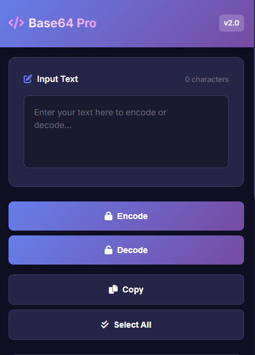

# Base64 Encoder & Decoder Pro

A modern Chrome extension for encoding and decoding Base64 text with a beautiful dark theme interface.



## ✨ Features

- 🔒 **Encode & Decode** - Convert text to/from Base64 format
- 🎯 **Auto-detection** - Automatically detects input type
- 📋 **One-click copy** - Copy results to clipboard instantly  
- ⌨️ **Keyboard shortcuts** - `Ctrl+E` encode, `Ctrl+D` decode, `Ctrl+L` clear
- 🌙 **Dark theme** - Modern purple gradient interface
- 💾 **Download results** - Save as text files
- ⚡ **Offline support** - Works without internet

## 🚀 Installation

### Option 1: From Source
1. Download this repository
2. Open Chrome → `chrome://extensions/`
3. Enable "Developer mode"
4. Click "Load unpacked" and select the folder
5. Extension appears in your toolbar!

### Option 2: Chrome Web Store
*Coming soon - will be published to Chrome Web Store*

## 📖 How to Use

1. **Click the extension icon** in your Chrome toolbar
2. **Enter your text** in the input field
3. **Click Encode or Decode** (or use keyboard shortcuts)
4. **Copy the result** with one click

## ⌨️ Keyboard Shortcuts

- `Ctrl+E` - Encode text
- `Ctrl+D` - Decode text  
- `Ctrl+L` - Clear text
- `Ctrl+C` - Copy result

## 🛠️ Development

```bash
# Clone the repository
git clone https://github.com/elgenawi/Base64-Encoder-Decoder-Extension-.git

# Load in Chrome for testing
# Go to chrome://extensions/ → Developer mode → Load unpacked
```

## 📄 License

MIT License - see [LICENSE](LICENSE) file for details.

## 🤝 Contributing

1. Fork the repository
2. Create your feature branch: `git checkout -b feature/amazing-feature`
3. Commit changes: `git commit -m 'Add amazing feature'`
4. Push to branch: `git push origin feature/amazing-feature`
5. Open a Pull Request

## 📞 Support

- 🐛 **Bug reports**: [GitHub Issues](https://github.com/elgenawi/Base64-Encoder-Decoder-Extension-/issues)
- 💡 **Feature requests**: [GitHub Issues](https://github.com/elgenawi/Base64-Encoder-Decoder-Extension-/issues)
- 👨‍💻 **Developer**: [GitHub Profile](https://github.com/elgenawi)

---

**Made with ❤️ by [Elgenawi](https://github.com/elgenawi)**
